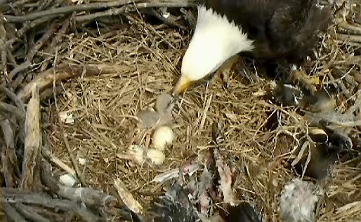

**Eggcellent Eaglets?**

****

The stork visited the Twin Cities EagleCam nest this week, bringing two eaglets into the digital world. 

The Minnesota DNR’s live-video link has had its eagle eye directed on the mom-and-pop bald eagles, giving viewers worldwide a glimpse. The hatching brings soaring excitement and relief, as the birds and their eggs weathered the recent harsh cold to emerge downy. See it yourself: webcams.dnr.state.mn.us/eagle/

*—Roma Rowland, Administrative Assistant*

*Departments of Asian Art and Japanese & Korean Art, March 6*

Image: A screenshot of the Minnesota Department of Natural Resources' "EagleCam" shortly before noon on Wednesday, March 26 (MNDNR)

Source: Joseph Lindberg, “Twin Cities' EagleCam eagles add baby to nest,” *Pioneer Press* (TwinCities.com), March 26

