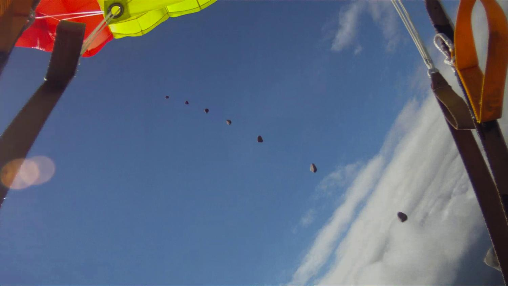

**The sky is falling—psych!**

****

Last week, Norwegian skydiver Anders Helstrup excited sky watchers and Chicken Little’s alike when his helmet camera caught what appeared to be a meteorite racing him towards Earth. News sources told of how Helstrup’s close call was the first time anyone had caught a meteorite in “dark flight”—that is, when it’s no longer sparkling, and well, in light-flight. Obviously.

As it turns out, the sky is not falling. It was announced this week that the meteor was an imposter; actually, it was a pebble tucked away in the parachute from a previous flight.     *—Roma Rowland, Administrative Assistant*

*Departments of Asian Art and Japanese & Korean Art*

*April 9*

Photo credit: Anders Helstrup / Dark Flight, montasje: Hans Erik Foss Amundsen

Source: nrk/Viten, “Norwegian skydiver nearly struck by meteorite,” April 3, 2014

