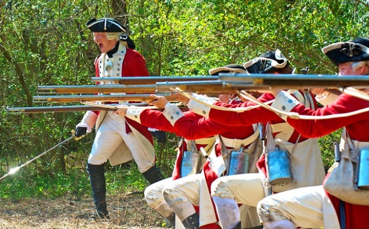

**Do you speak American?**

****

AMC’s new series *Turn* details the exploits of the Culper Ring, a group of American revolutionaries who spied on the British. Early reviews are decidedly mixed. English characters, burdened with the predictable accoutrements of villainy, are one dimensional: they’re posh punters in powdered wigs.

A more interesting creative choice: in *Turn*, Americans and Britons alike sound vaguely like Branson, the Irish chauffeur in *Downton Abbey*. Linguistic research suggests that the British had only just started affecting that Oxbridgian soft “r” (think “dahling” instead of “darling”) at the time the series is set and actually sounded more like Americans do today!

*—Alex Bortolot, Content Strategist, April 15*

**

Image: AMC

Source: Carolyn Eastman, “The Revolution Takes a Turn: AMC’s Drama about Washington’s Spies Aims for Moral Complexity,” *Perspectives on History*, April 2014 

