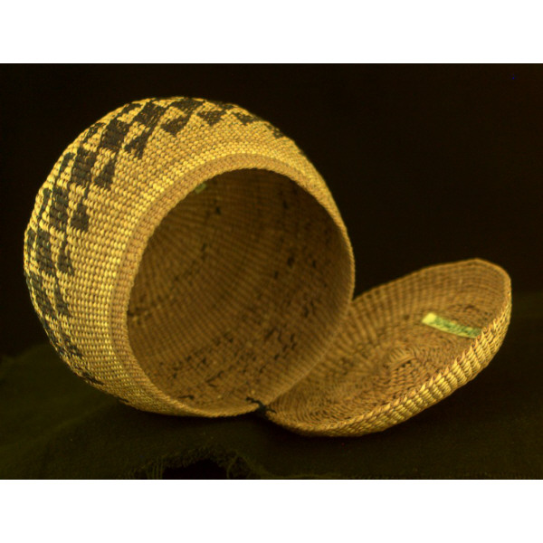

**Hope for Poisoned Artifacts?**

****

In the past, museums routinely doused their ethnographic collections with poison. It was a cheap and effective—if heavy-handed—tactic in the war against destructive pests. But it didn’t account for the possibility that the artifacts would one day be returned to their former owners.

Today some of America’s oldest museums are honoring Native American requests for the return of sacred objects. They’d like to use them again in religious rites, but the poisoned ones are unsafe. Detox has always been too expensive. Now scientists at the Arizona State Museum are piloting much cheaper techniques that may ultimately put more sacred objects (literally) in the hands of their rightful owners.

*—Alex Bortolot, Content Strategist, May 28, 2014*

**

Image: California State Parks Museum Collections, 309-335-196

Source: http://www.popsci.com/article/science/way-put-toxic-museum-artifacts-back-their-original-owners-hands

