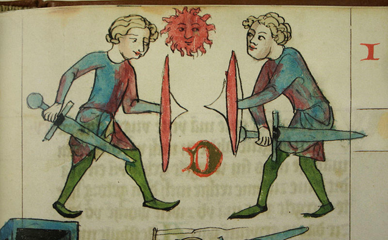

**Was Trial by Combat Good Economics?**

****

In medieval England, disputing parties would hire “champions” to fight on their behalf in a brutal trial by combat—decisive and, well, medieval. But coming to blows may have been more beneficial than it sounds.

 

As a law and economics professor at George Mason recently argued, medieval England’s elaborate property laws made it incredibly hard to buy and sell real estate—trial by combat was a clever workaround. But it also may have benefitted the economy. Better fighters cost more, so theoretically the party with more resources to develop the land would win. Fundamentally fair? Absolutely not. But neither was the alternative.

*—Alex Bortolot, Content Strategist, May 28, 2014*

**

Image: Wikimedia Commons, *Gerichtlicher Zweikampf.jpg*

www.slate.com/blogs/moneybox/2014/05/19/game\_of\_thrones\_season\_4\_episode\_7\_the\_real\_life\_advantages\_of\_trial\_by.html

