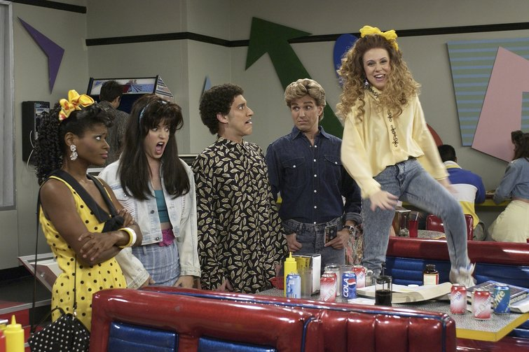

**Kids today…are good?**

****

If you’ve been huffing about teenagers lately, you might want to watch your step—because if you’re over 18, you do not have the moral high ground. By the numbers, American teens today are the best-behaved bunch on record. 

Mind you, the numbers are limited to health: an all-time low teen birth rate, dramatic drops in teen abortion, fewer teens having unprotected sex, less drinking, less smoking, and more exercising. But they add up to one thing: Justin Bieber aside, kids today might have more sense than you did.

*—Tim Gihring, editor*

*May 29, 2014*

Source: Vox.com, May 29, 2014

