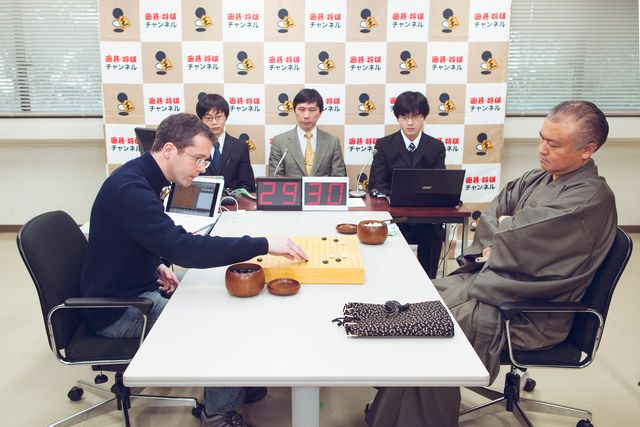

**Computers stopped by Go?**

****

Computers have trumped humans at chess, Scrabble, poker, and many other things (like calculating Pi to five trillion digits). But no machine has beaten a human at the game of Go. Ever. 

One game program, Crazy Stone, finally did beat Japanese pro Norimoto Yoda—but only after a four stone handicap, and it wasn’t pretty. Computer scientists are puzzled as to why their artificial intelligences aren’t intelligent enough to best even an amateur Go player. But it seems the endgame is crucial, and Crazy Stone, as its name implies, made some crazy embarrassing moves.

*—Roma Rowland, Administrative Assistant*

*Departments of Asian Art and Japanese & Korean Art*

*May 29, 2014*

**

Photo credit: *Takashi Osato/WIRED*

http://www.wired.com/2014/05/the-world-of-computer-go/

