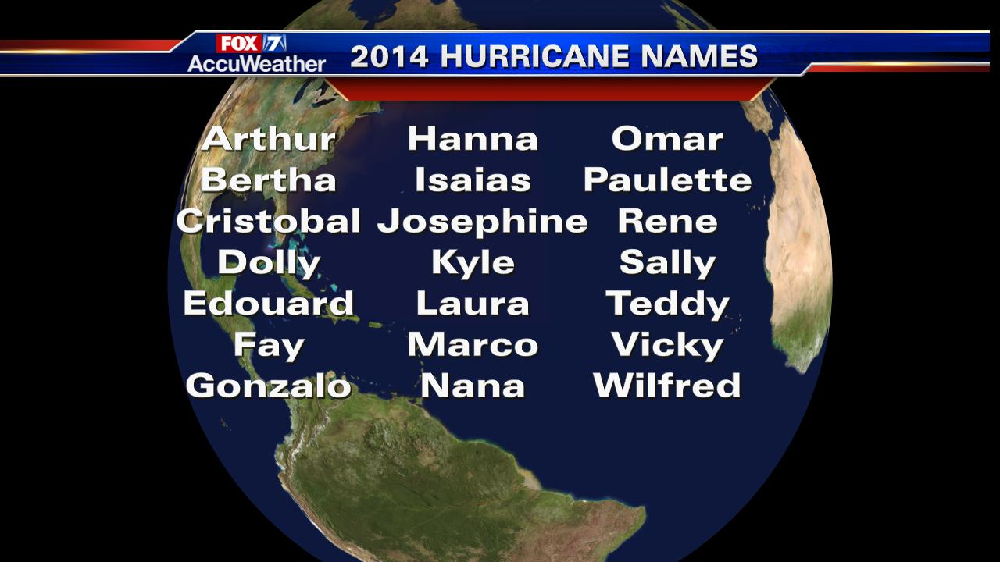

**Who’s afraid of a female hurricane?**

****

Not people in the path of them. In a remarkable testimony to the power of gender bias, researchers recently found that hurricanes given female names are deadlier than those with male names, even when they’re the same strength—apparently because feminine-sounding storms are perceived as less dangerous.

Study participants told that a Hurricane Danny was approaching were more likely to evacuate than those told that a Hurricane Kate was imminent. Hurricanes weren’t named at all when one of the worst in New England history struck Providence in 1815—they weren’t even called hurricanes. It was called the Great September Gale (not Gail).

*—Tim Gihring*

*June 4, 2014*

Source: Los Angeles Times, June 2, 2014

