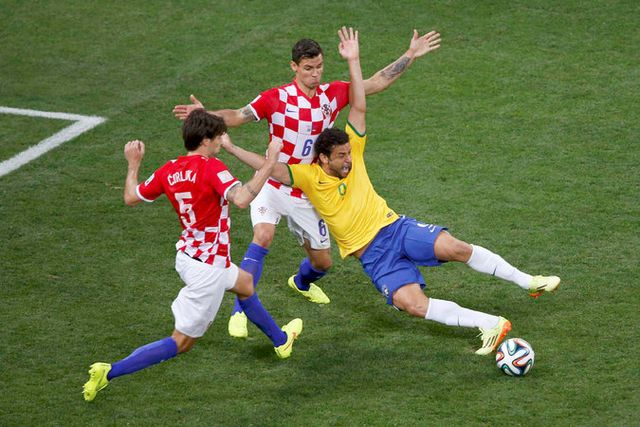

**U.S. a flop at flopping? **

****

The wild gestures captured in this painting look like the real deal. But World Cup watchers are wondering if U.S. soccer players punt in the art of playacting.

Feigning injury is legendary among footballers eager to convince referees to make calls benefiting their side. A light tap can turn into a major arm-waving flop on the field. American players, however, seem reluctant to join the fray. Graham Zusi, a U.S. midfielder, said flopping “is something I’ve never really incorporated into my game, and I don’t plan on it.” He shrugs it off as Americans’ sense of fair play, on and off the field.     *—Diane Richard, writer, June 18*

Image: Photo by: Paulo Whitaker/Reuters 

Source: Sam Borden, “Where Dishonesty Is Best Policy, U.S. Soccer Falls Short,” *The New York Times,*June 14

