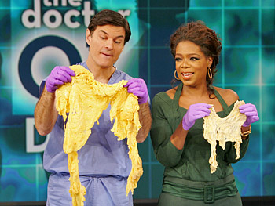

**Miracle? Not so fast…**

****

Telegenic doctor Mehmet Oz was recently reprimanded for touting “miracle” weight-loss cures on his TV program, *The Dr. Oz Show*. Senator Claire McCaskill enumerated instances in which Dr. Oz claimed to hold a “miracle in a bottle.” He had promoted three tropical supplements: green coffee extract, raspberry ketone, and garcinia cambogia, related to tamarind. 

“The scientific community is almost monolithic against you,” said McCaskill, chastising Dr. Oz. “When you call a product a miracle, and it’s something you can buy, it’s something that gives people false hope.”
       —*Katie Wildfong, Family & Teen Programs, June 18*

Image source: fitbodiez.com

