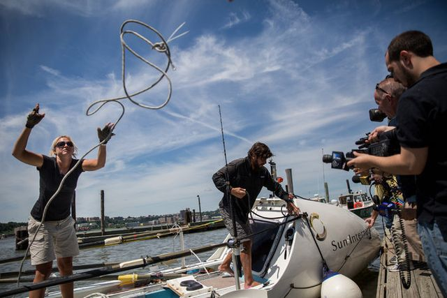

**Merrily, merrily? **

****

Rowing a boat is a tranquil pastime, right? Not for two extreme adventurers who just completed a very long, rigorous row—from Agadir, Morocco, to NYC.

The South African couple gave themselves only two days to learn how to handle an oar. Then, row they did in their custom craft, all day, every day, for six months straight, without a support boat. They communed with dolphins and sharks. They watched videos on a laptop. They argued, lots, then spent three days without speaking. Though they did stop in the Bahamas and Miami, most of the journey was without land in sight. The two estimated having taken 3.6 million strokes.     *—Diane Richard, writer, June 25*

Image: Credit Jake Naughton/*The New York Times*

Source: Corey Kilgannon, “Adventurous Couple Arrive in New York From Africa, Merrily, Merrily,” *The New York Times,*June 20

