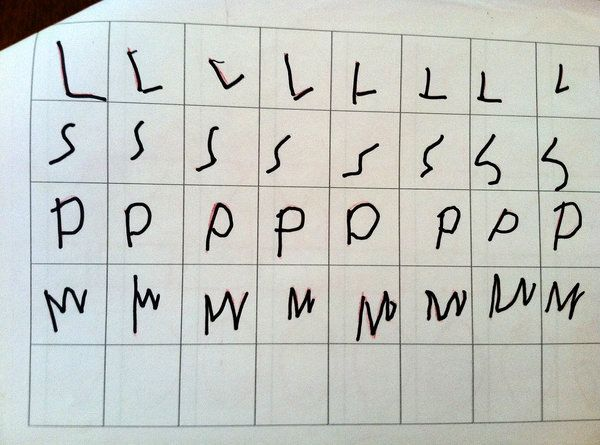

**A, B, Cs or QWERTY?**

****

In our rush for early computer literacy, the Palmer method of handwriting has gone the way of eight-track tape. Most educators today have dropped cursive from the curriculum, focusing more on keyboard typing. 

However, recent studies have shown that children who learn how to write out letters by hand develop and strengthen different areas of their brains to express ideas more fully. It’s no wonder Chinese literati focused so much on the rituals and tactile practice of calligraphy and painting. Intelligence, self-control, and learning ability are all cultivated through pen and ink on paper. 

*—Roma Rowland, Administrative Assistant*

*Departments of Asian Art and Japanese & Korean Art*

*June 5*

Photo credit: Karin James, *The New York Times*

Source: MARIA KONNIKOVA, “What’s Lost as Handwriting Fades,” *The New York Times,*June 2

