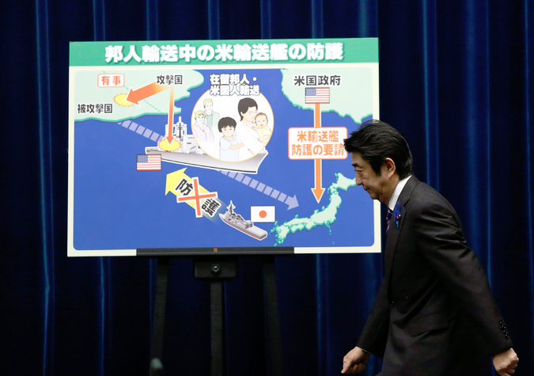

**Pacific reawakening? **

****

Japan’s prime minister formally announced his nation’s intent to rebuild its military infrastructure, reversing a non-militaristic policy in force since the end of World War II. Japan’s army is only employed for self-defense.

Faced with a growing crisis in its neighboring waters, with China claiming disputed islands and exploring deep-sea oil deposits, Japan is now reasserting itself as a force to be reckoned with. Prime Minister Shinzo Abe, a nationalist, says the Japanese military would only be used to protect its allies. Still, the hawkish response is likely to anger the Chinese—who have never forgiven Japan for its wartime occupation—and could set Asia’s two biggest powers even more at odds.       *—Diane Richard, writer, July 2*

Image: Credit Image by Yuya Shino/Reuters

Source: MARTIN FACKLER and DAVID E. SANGER, “Japan Announces a Military Shift to Thwart China,” *The New York Times,*July 1

