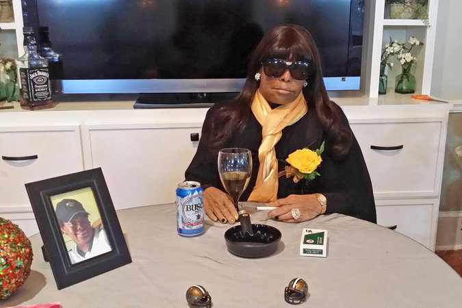

**A lifelike resemblance?**

****

This fantasy coffin dovetails nicely with an eye-opening trend: placing the dead in a favorite pose at the funeral.

True, only a handful of customers have requested the treatment—notably in New Orleans and Puerto Rico—but the photographs are striking. A former boxer wanted to be remembered in the ring, gloves on. The woman below, with wine, beer, and a pack of menthols. A funeral director involved in one such naturalistic service denied attempting to put the “fun” in funerals; rather, he said it was a unique way to help loved ones grieve.       *—Diane Richard, writer, July 2*

**

Image: Percy McRay, via Reuters

Source: CAMPBELL ROBERTSON and FRANCES ROBLES, “Rite of the Sitting Dead: Funeral Poses Mimic Life,” *The New York Times,*June 21

