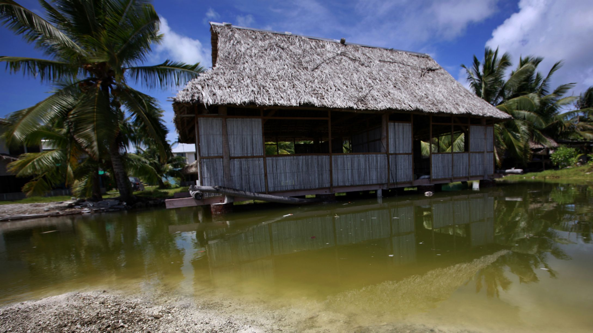

**Refugees from a changing climate?**

****

The island nation of Kiribati recently purchased a 7.7-square-mile tract of forest on a nearby Fijian island. It’s a backup plan: if sea levels keep rising, Kiribati will need someplace else for their 103,000 citizens to live. With the sea creeping up about half an inch a year now, the country could be entirely beneath the waves by 2100. 

Some Kiribati residents have asked for asylum in New Zealand, claiming the burning of fossil fuels that is changing the climate is a form of oppression on the part of industrialized nations. Wherever they end up, they won’t be alone: by 2050, researchers say, there could be as many as 700 million “climate refugees.”

*—Tim Gihring, Editor*

*July 4, 2014*

**

Source: Qz.com, July 1, 2014

