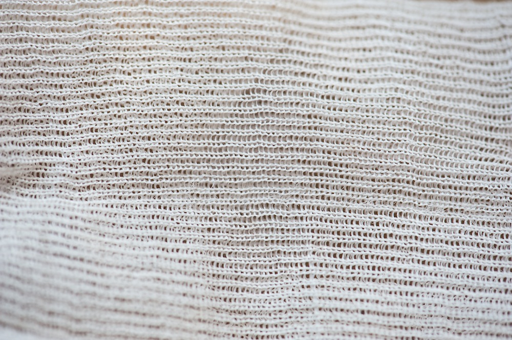

**New take on under armor?**

****

Imagine what the soldier who once sported this armor would think if he were handed silk combat gear instead. He’d probably dance a jig—and he actually *could*.

A company based in Michigan has genetically engineered silkworms to produce spider’s silk, a light, flexible material that’s stronger by weight than high-grade steel. Long discussed as a possible protective material, spider silk could prove to be a far more comfortable alternative to the traditional, solid Kevlar vest worn by soldiers and police officers. Industrial silk has also been spun from genetically modified goats.           *—Diane Richard, writer, July 8*

**

Credit: Kraig Biocraft Laboratories; a closeup of gloves made out of spider silk

Source: Elizabeth Howell, “Future Soldiers May Wear Bulletproof Spider Silk,” *Live Science,*June 25

