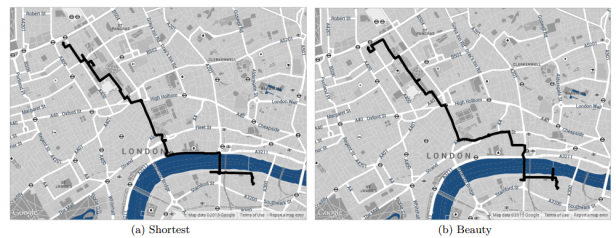

**An App for Wanderlust?**

****

Developers with Yahoo have created a GPS program that maps out the most beautiful route, not necessarily the shortest (beauty resulting in a 12-percent longer trip on average). Created by crowdsourcing and images from Google Street View, Geograph, and even Flickr, the maps have proven to be extremely successful in plotting the most striking, quiet, and happy strolls for tourists and locals alike. The scenic route, indeed.

*—Roma Rowland, Administrative Assistant*

*Departments of Asian Art and Japanese & Korean Art*

*July 14, 2014*

Photo credit: MIT Technology Review

News source: “Forget the Shortest Route Across a City; New Algorithm Finds the Most Beautiful“ Emerging Technology From the arXiv

