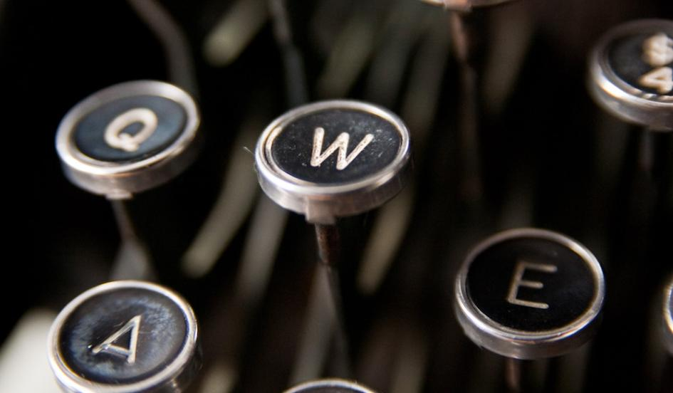

**Spies vs. typewriters?**

****

Don’t toss your old typewriter just yet (we know it’s still sitting in the basement), especially if you’re in the business of creating confidential documents. 

Last year, to throw off American spies, Russian security agencies went back to using old-fashioned, un-hackable typewriters. And now German politicians, spooked by widespread U.S. espionage, are recommending the same in their country. Not even the newer, electronic models but the plink-plunk manual style—even harder to bug. And no time wasted surfing the Web.

*—Tim Gihring, editor*

*July 17, 2014*

Source: Newsweek, July 16, 2014

