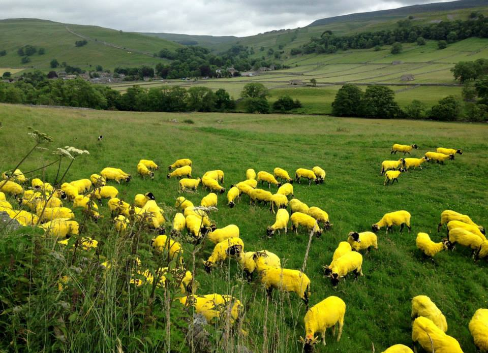

**Where yellow means ‘Go’?**

****

The 101st-annual Tour de France wraps up in Paris on Sunday, July 27, with the coveted*maillot jaune* (yellow jersey) to be awarded to whichever rider completes the 3,664-kilometer, three-week race with the fastest overall time. This year’s epic race course wound all over both England and France, and was peppered with enthusiastic fans celebrating the Tour with fantastic displays of its signature color: yellow. 

On this year’s opening day, called the *Grand Départ*, Yorkshire farmers made quite a spectacle by dyeing entire flocks of sheep a vivid shade of yellow. Très magnifique!

*—Katie Wildfong, Family & Teen Programs, July 23*

**

**

**

Image via reddit.com

Source: Philip Case, “Yorkshire sheep in Tour de France makeover,” *Farmers Weekly*, July 7, 2014.

