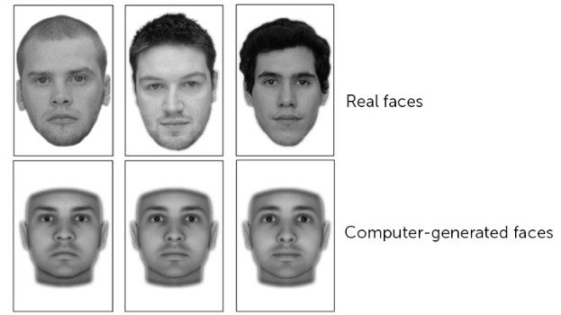

**Would you trust this face?**

****

Talk about snap judgments: A recent study shows that our brains gauge the trustworthiness of a face before we even truly look at it. Researchers publishing their results in the *Journal of Neuroscience* revealed that the part of our brains that processes emotion, the amygdala, has deemed two features especially untrustworthy: downward-sloped eyebrows and flattened cheekbones.

Of course, we all know one shouldn’t judge a book by its cover. Still, this exhibition may put your skills to the test. Get to know this crew of cut-throat law breakers. It’s a killer show!

*—* *Ana Taylor, Assistant Photographer, August 7*

**

Image: *Journal of Neuroscience*

Source: Nancie George, “Face Value: How Our Brain Decides Who We Can Trust,” *Everyday Health,*August 6

