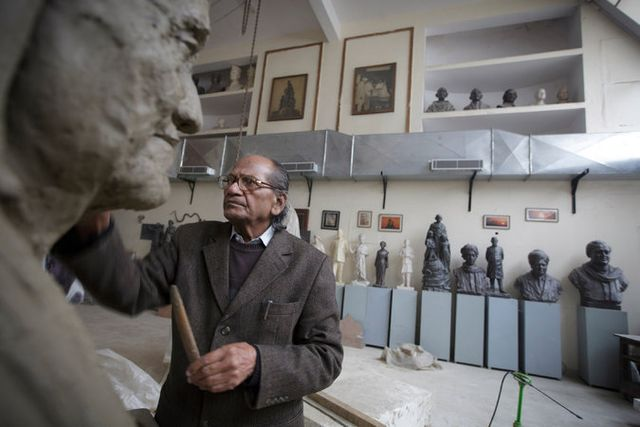

**Bigger is better?**

****

This statue of Siddartha Gautama, the founder of Buddhism, is presumably just under life size. Not so the sculpture being commissioned by India’s new government, which at 597 feet high will be the world’s largest, nearly twice as tall as the Statue of Liberty.

Called the Statue of Unity, it will depict an independence leader who helped unite India’s fractious states. The size is intended to overwhelm statues of the Gandhi family, the rivals of India’s new governing party. Ram V. Sutar, the leading contender for the commission, is happy to help: supplying the statue race between India’s competing parties has made him the most prolific monumental sculptor in history.

*—Tim Gihring, editor*

*August 12, 2014*

**

Source: New York Times, August 4, 2014

