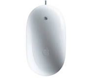
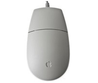
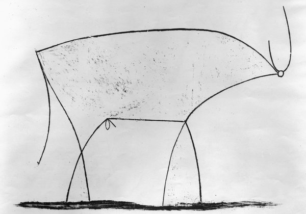
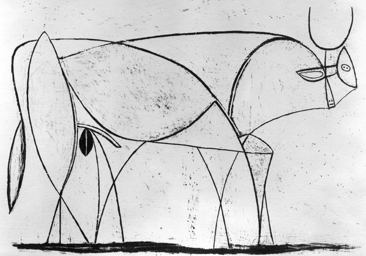
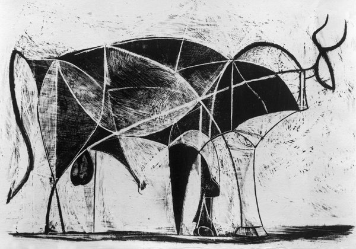
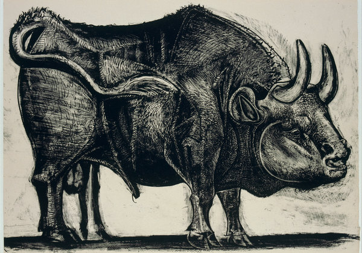

**Apple not fall far from art?**

****

Apple, known for its intuitive design and deep secrecy, takes a page from masterpieces for its iconic devices. That’s according to Apple workers who leaked details about their internal training program, Apple University.

Apple educators liken the company’s process of product refinement to that of Picasso’s, Modigliani’s, and other modernist masters. A series of lithographs that make up Picasso’s *The Bull*, they say, shows similar techniques of paring details to achieve the streamlined simplicity of its iPhones, iPads, and iMacs.*—* *Diane Richard, writer, August 13*

**

Images: Bull images by Art Resource, NY; 2014 Estate of Pablo Picasso/Artists Rights Society (ARS), New York; the ergonomic innovations of Apple mice

Source: Brian X. Chen, “Simplifying the Bull: How Picasso Helps to Teach Apple’s Style,” *The New York Times,*August 10

