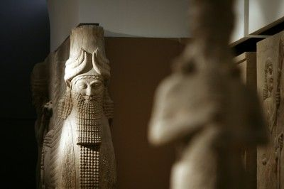

**Raising Cain,
 Razing culture**

****

The Islamic State of Iraq and Syria (ISIS) has unleashed enormous destruction. Say what you like about its cause: to establish a caliphate across the Middle East. Its effect is undeniable: mayhem, slaughter, and thousands of years’ worth of cultural treasures reduced to rubble.

This panel was taken from the remains of an imperial palace at Nimrud, the capital of the Assyrian empire, now located in modern Iraq. Excavated in the mid-19th century, the temple yielded this panel, one of the first examples of ancient Mesopotamian art to reach the Western world. I hope museums won’t be the sole remaining place for them to continue to exist.     —*Diane Richard, writer, August 27*

**

Image: Ali Al-saadi/AFP/Getty Images

Source: Aki Peritz, “The Islamic State isn’t just killing people. It’s destroying a culture,” *The Washington Post,*August 22

