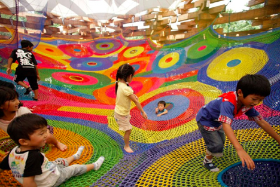

**Play’s the thing?**

****

New research shows the value of open-ended play on developing brains, and some scientists say that playtime may be even more valuable than classroom time. 

By studying animal brains, scientists have found that certain kinds of play change neurons in the prefrontal cortex. Kids who engage in rough-and-tumble play and play games without rules develop stronger executive function, linked to emotional regulation and problem-solving skills. Studies also show that early development of the kinds of social skills linked to play is also linked to academic success later in life. So get to work—go play!

*—Katie Wildfong, Family & Teen Programs, August 27*

**

Image: Toshiko Horiuchi Macadam, via billygrrl.com

Source: Jon Hamilton, NPR’s Morning Edition, “Scientists Say Child’s Play Helps Build a Better Brain,” August 6, 2014

