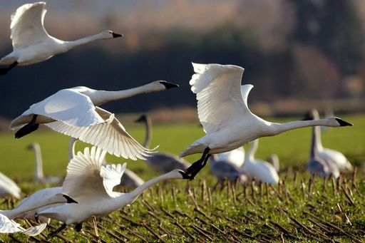

**Fouling our own nests?**

****

North American birdlife could look quite different mid-century thanks to climate change’s impact on habitat. 

According to a widely publicized study by the National Audubon Society, trumpeter swans and northern hawk owls, among others, could go extinct as soon as 2050, and Baltimore orioles will likely flee Maryland. Populations of Minnesota’s state bird, the loon, are also seen to be at risk over the warming temperatures. The study says about half of the approximately 650 species will be driven to smaller spaces or forced to find new places to live, feed, and breed over the next 65 years. Otherwise, they could go the way of the dodo.
 —*Diane Richard, writer, September 10*

**

Image: Elaine Thompson/Associated Press

Source: Felicity Barringer, “Climate Change Will Disrupt Half of North America’s Bird Species, Study Says,” *The New York Times*, August 24, 2014

