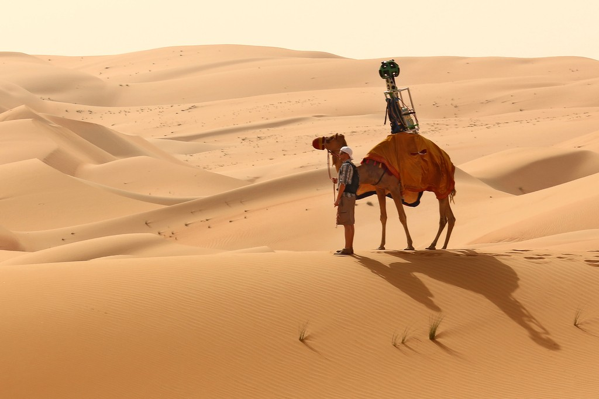

**Google riding high?**

****

By now we’ve all seen Google’s Street View camera, slowly documenting the curb appeal of city and towns around the globe.

In places without curbs, however, the mega-tech company has improvised. Like, say, using a 10-year-old camel named Raffia. In Google’s first use of animals since starting the project in 2007, Raffia and a handler walked the Liwa Oasis, a supposed tourist spot in the south west of Abu Dhabi emirate. The camera-bedecked camel captured 360-degree views of the desert terrain.
     —*Diane Richard, writer, October 15*

Image: Courtesy Google

Source: Lindsay Carroll, “Google offers a camel’s eye view of Liwa Oasis,” *The National UAE,* October 8, 2014

