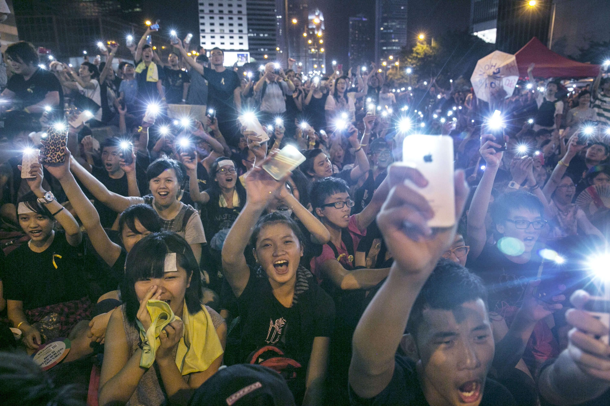

**By the light of the phone?**

****

It’s been called the Umbrella Revolution. But another notable image from the Hong Kong protests involves more recent technology: the use of cell phones as glowing stand-ins for candles or torches, held aloft during vigils.

If the phones don’t have quite the visceral impact of flaming torches—“Bring your pitchforks and iPhones, everyone!”—they do underscore the modernity of Hong Kong and its argument for more progressive government.

*—Tim Gihring, editor*

*October 1, 2014*

Source: Getty Images, October 1, 2014

