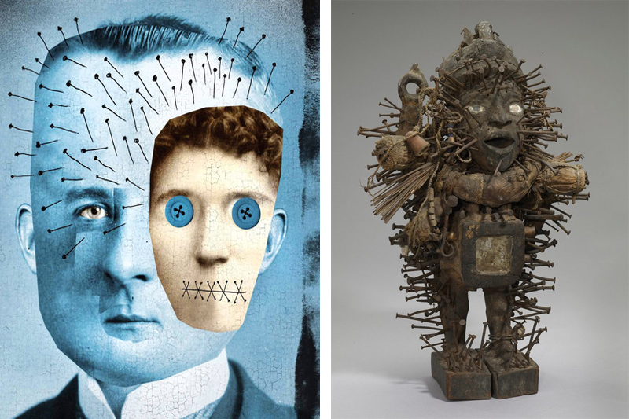

**Are you a magical thinker?**

****

We adults like to think we’re rational. We don’t believe in fairies (most of us). We don’t think we’re Peter Pan (most of us). And yet we’re very prone to magical thinking (all of us).

Researchers recently asked college students to throw darts at several images, including one of a baby. Guess which image they missed the most? Yep, even though we rationally realize that no actual baby would be hurt by a dart through the eyes of a printed image, we can’t bring ourselves to tempt fate. But it’s not a bad thing. Nailing our troubles into a power figure like this one, for instance, let’s us put them to rest—mind over matter.

*  —Tim Gihring, editor*

*November 14, 2014*

Source: New York Times, October 27, 2014

