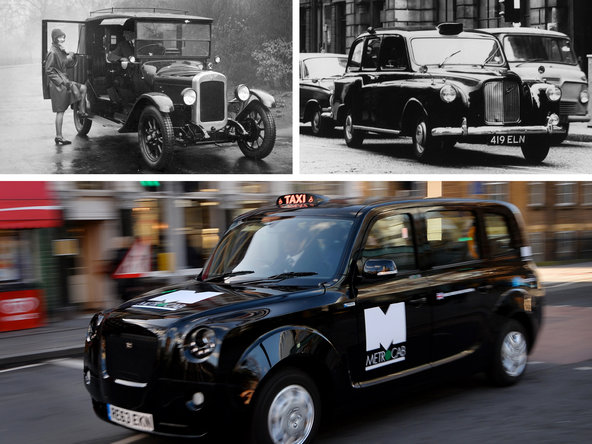

**All hail education?**

****

This handkerchief shows that certain students will always look for academic shortcuts, even cheating.

Not drivers of London’s black taxi fleet. These legendary cabbies invest years in learning routes and sites by studying maps, driving routes, mnemonic devices, and visual cues. Their training, called The Knowledge, is rigorous and rewarding. Scholarship has shown that the posterior hippocampus, the area of the brain associated with memory, is bigger in London taxi drivers than in most people. Now, their training is under threat by 21st-century tech: Uber and GPS.     —*Diane Richard, writer, Dec. 11*

**

Images: Clockwise from top left: E.F. Corcoran/Topical Press Agency, via Getty Images; Malcolm/Getty Images; Ben Stansall/Agence France-Presse – Getty Images

Source: Jody Rosen, “The Knowledge, London’s Legendary Taxi-Driver Test, Puts Up a Fight in the Age of GPS,” *New York Times,* November 10, 2014

