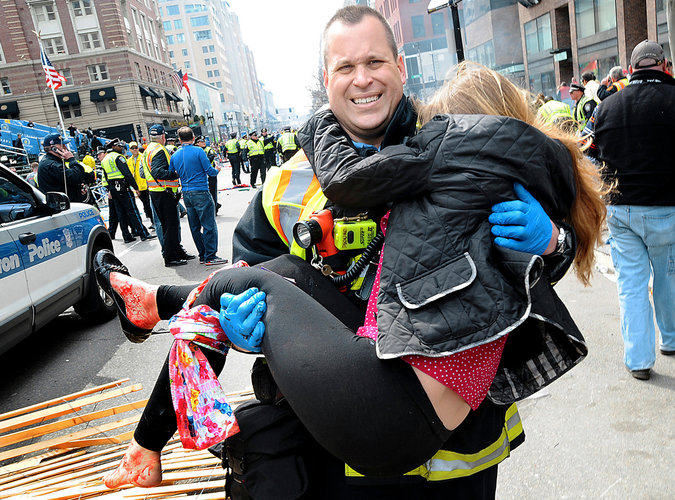

**Police Tie One On?**

****

The humble tourniquet has proven its mettle in battles and crises since the time of Alexander the Great, saving both life and limb of soldiers and civilians.

Today, the technique of tying cloth above an injured limb to stanch bleeding is increasingly the job of metropolitan police departments, in response to the mass shootings and explosions of our time. The faster the tourniquet is tied, the more likely a life will be saved. Thanks to its use, only 2 percent of soldiers died from severe bleeding as a result of wounds in recent wars and atrocities, like the Boston bombings.             *—Diane Richard, writer, January 22*

 

Image: Ken McGagh/MetroWest Daily News, via Associated Press

Source: Michael S. Schmidt, “Reviving a Life Saver, the Tourniquet,” *New York Times*, January 19, 2014 

