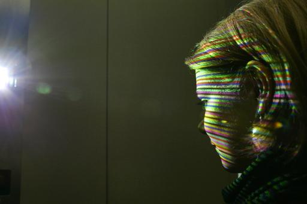

**Betrayed by your face?**

****

This boy looks more than depressed; he looks like he’s got one foot in the grave. He has; it’s a death portrait. 

 

Today’s facial recognition technology is proving to be as deft as the artist who painted this portrait in identifying the ways depression plays out across our faces. Researchers at Carnegie Mellon, for instance, are using a multi-modal algorithm to analyze facial expression based on 68 points on the face, including the eyebrows, eye corners, mouth, and nose. The findings are interesting: both depressed and non-depressed people smiled with the same frequency, but depressed people’s smiles faded more rapidly. Also, depressed women frowned less frequently than non-depressed women—the opposite of depressed men. Researchers hope the technology will help clinicians diagnose and treat people with signs of depression and PTSD.           *—Diane Richard, writer, October 22*

**

Photo credit: Michaela Rehle / Reuters

Source: Adrienne Lafrance, “Machines That Can See Depression on a Person's Face,” *The Atlantic*, October 19, 2015

