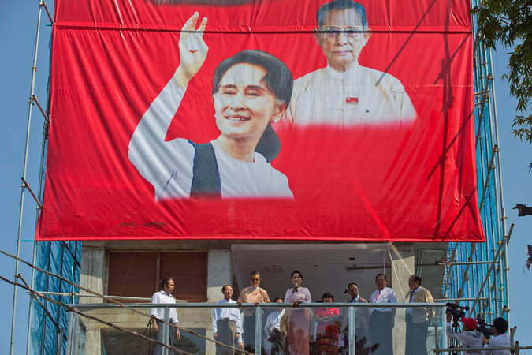

**The people have spoken.**

****

After two decades of house arrest, pro-democracy leader Daw Aung San Suu Kyi has led her party, the National League for Democracy, to a landslide victory this month in parliamentary elections that upended the Myanmar’s military power structure. 

 

A symbol of dignified nonviolent resistance, the Nobel Peace Prize recipient sacrificed much to see this day. While confined to house arrest by the generals who have governed Myanmar—formerly known as Burma—for half a century, she lost her freedoms, witnessed her fellow citizens founder under oppression, and her husband died in England. In fact, her marriage to a foreigner makes her ineligible to become the country’s president. “I will be above the president,” she declared.    *—Diane Richard, writer, November 18*

**

Photo credit: Mark Baker/Associated Press

Source: Seth Mydans, “Aung San Suu Kyi, Long a Symbol of Dignified Defiance, Sounds a Provocative Note,” *The New York Times*, November 17, 2015

