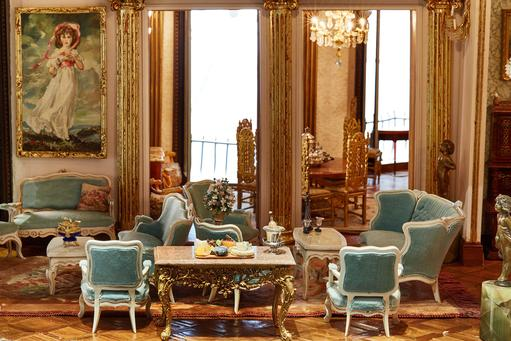
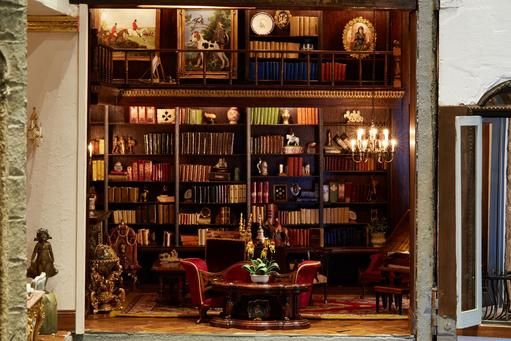

**Palatial dollhouse?**

****

Welcome to Astolat Castle. It took 13 years for Elaine Diehl, a celebrated miniature artist, to build the 9- foot-tall dollhouse, now appraised at \$8.5M. Located in New York City, it offers loads of luxury: a many-volume library, working lights, parquet floors, a marble bathroom with real t.p., and micro-taxidermy for wee hipsters. Even real liquor in tiny bottles!    *
   —Diane Richard, writer, November 18*

**

Photo credit: Photographer: Zack DeZon/Bloomberg

Source: Patrick Clark, “This Dollhouse Costs \$8.5 Million. Let’s Take a Tour,” *Bloomberg Business*, November 11, 2015

