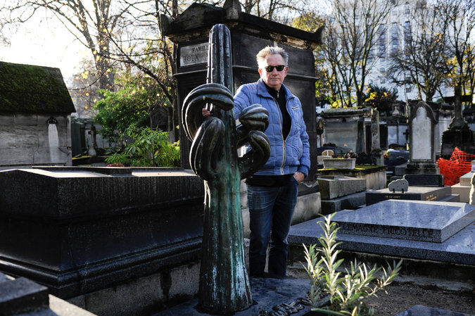

**Going out in style?**

****

The would-be occupant of this lobster coffin knew the value of a dramatic exit. 

So, too, does a crew of artists in Paris. They have bought a communal tomb in a cemetery near Montmartre and adorned it with a bronze sculpture large enough to house their cremated ashes. The sculpture, shaped like a cactus, bears less resemblance to a crucifix than to a certain provocative hand gesture. The scheme’s aim is to create an irreverent mausoleum that is a symbol of absurdity in this Parisian village of the dead, whose 21,500 graves include Edgar Degas and François Truffaut.*     
   —Diane Richard, writer, December 30*

**

**

Photo credit: Capucine Granier-Deferre for *The New York Times*

Source: Doreen Carvajal, “French Artists Will Take Their Irreverence to the Grave,”
 *The New York Times*, December 29, 2015

