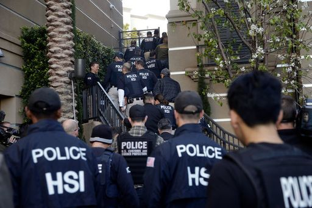

**USA Happy Baby?**

****

The desire to give a child a leg up in the world is universal. That drive is now spurring what’s known as “birth tourism” by parents who visit the United States in time to deliver their babies.

Recently, federal agents stormed 37 locations in Southern California, gathering evidence about what they say are three illegal “birth tourism” businesses catering to wealthy Chinese women. Such travel agencies, named things like Star Baby and USA Happy Baby, are believed to provide counsel to would-be clients, such as to wear loose-fitting garments in transit, along with housing and prenatal care. The moms-to-be spend as much as \$60,000 in hopes of securing American citizenship for their newborns.
 —*Diane Richard, writer, March 5*

**

Image: Jae C. Hong/Associated Press

Source: Tamar Lewin, “California Apartments Raided in Federal Investigation of Chinese
 ‘Birth Tourism’,” *The New York Times,* March 3, 2015

