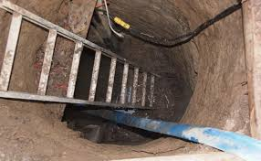

**Whose hidey hole?**

****

The recent discovery of an underground bunker in Toronto caused much speculation and not a little fear. Was it a tunnel for terrorists planning to attack a nearby university’s tennis stadium, site of the Pan Am Games? A pit for nefarious activities? A spot for teens to neck in?

Turns out, no. The two men who claimed the well-built, well-provisioned, moisture-resistant cave said that’s just what it was: a “man cave” in which to hang out. “It is simply two guys who just wanted to dig a cave,” said a Toronto police spokesman. The men apologized; no charges were filed. 

  —*Diane Richard, writer, March 5*

**

Image: CBC News

Source: “Toronto Tunnel Dug by Two Men as ‘Man Cave,’ Police Say,” *CBC News,* March 2, 2015

