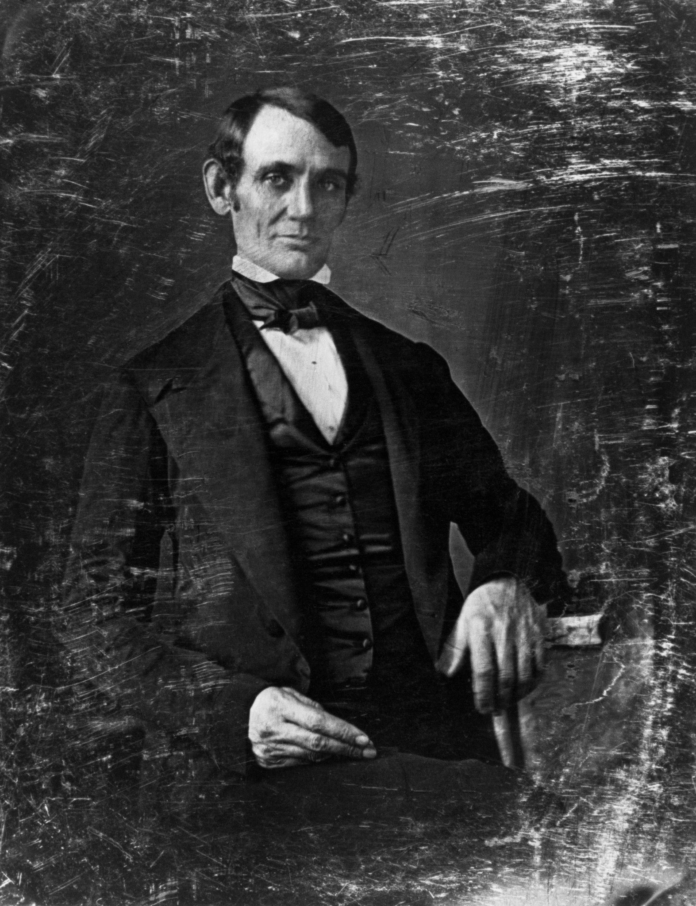

**‘A Glorious Burden’?**

****

Old family photos can be fascinating. But when they’re also historic treasures—and not even of your relatives—they can become “a glorious burden,” as one burdened by them admits.

Marking the 150th anniversary of the assassination of Abraham Lincoln, two works—HBO’s documentary *Living with Lincoln* and a new book *The Photographs of Abraham Lincoln*—depict the role of the Kunhardt family as keepers of history. Thanks to an ancestor’s collecting instincts, the Kunhardts lived among a trove of portraits of Abraham Lincoln and his contemporaries—some 68,000 images, as well as 2,000 other items. Peter W. Kunhardt Jr. recalls seeing images of Lincoln in every room of his suburban childhood home. Yale University recently acquired the collection, freeing up Kunhardt to manage the archive of Gordon Parks. —*Diane Richard, writer, April 15*

**

Image: Courtesy of the Meserve-Kunhardt Foundation
 Source: David Gonzalez, “All in the Family With Lincoln,” *The New York Times,* April 13, 2015

