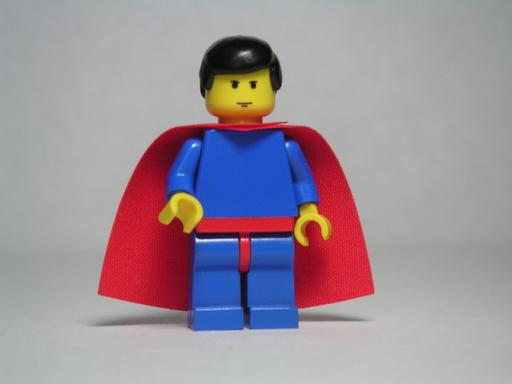

**Striking a pose?**

****

A “power pose,” if you aren’t already standing in one, is a hands-on-hips, square-jawed stance that imbues its wearer with strength. It was popularized by Amy Cuddy, a Harvard Business School social psychologist, in a much ballyhooed 2012 TED Talk.

Recent research, however, subdues the original study’s claims of biochemical mega boosts. An attempt to replicate the responses, published in *Psychological Science*, found no behavioral or hormonal effects of power poses. The latest study tweaked the original by evaluating a larger sample size (200 instead of 42) and controlling for experimenter bias. Still, the University of Zurich researchers did confirm one important thing: power poses can enhance one’s subjective perception of power—which may be powerful in itself.
 —*Diane Richard, writer, April 22*

Image: Andrew Becraft
 Source: Cathleen O’Grady, ““Power poses” might not be so powerful after all,” *Ars Technica,* April 6, 2015

