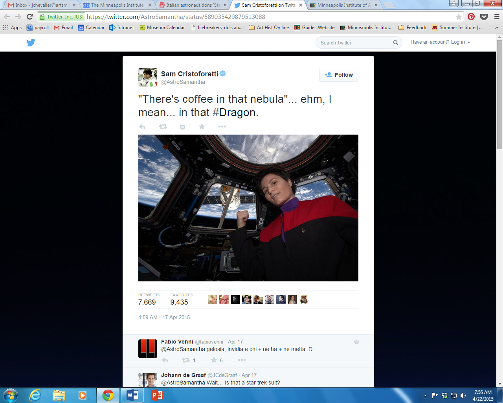

**Starbucks in Space?**

****

The owner of this elegant silver coffee service from 1823 probably could not have imagined space travel. Today, we assume astronauts eat dehydrated meals and drink Tang. If we think of them drinking coffee (not that I have until now), it’s certainly not a double-shot macchiatto with a sprinkle of cinnamon. 

But that may change. Earlier this month the Dragon spacecraft delivered an espresso machine (among other supplies) to the International Space Station. The Italian astronaut Samantha Cristoforetti donned her replica uniform from *Star Trek: Voyager* to celebrate its arrival. Now, about that zero gravity problem…

*—Juline Chevalier, Head of Interpretation and Participatory Experiences*

*April 22*

Image: Samantha Christoforetti’s Twitter feed @AstroSamantha, April 17, 2015

Source: Lee Moran, “Boldly caffeinated: Italian astronaut dons 'Star Trek' uniform to celebrate arrival of International Space Station's espresso machine,” *New York Daily News*, April 21, 2015

