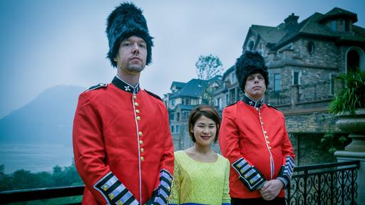

**Adventures in real estate?**

****

Look closely at this capable camel driver. With his pronounced nose and Euro/Indic features, he was likely modeled after a trader from the Middle East or region now ending in –stan. 

A millennium and a half later, China continues to look across its borders to convey an air of international mystique or marketing edge. Today, an agency representing over-valued condos in what is otherwise a “ghost town” is employing foreign faces to project a Western *je ne sais quoi*. Such schemes, as illuminated in a *New York Times* Op-Doc video, put the sass in ersatz. At events thrown to attract would-be buyers, ordinary expats (dressed only in underpants) are introduced as America’s top male models. (One “model” wryly notes: “Everything is fake. We just show up to give them a white face.”)   —*Diane Richard, writer, April 29*

Image: David Borenstein
 Source: David Borenstein, “‘Rent-a-Foreigner in China’,” *New York Times,* April 28, 2015

