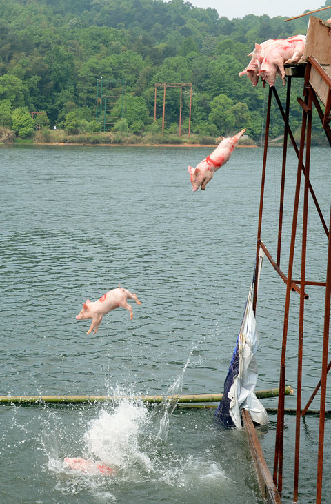

**When pigs fly?**

****

This 2,200-year-old barnyard scene highlights China’s relationship with pigs. No doubt, China *loves* pigs—as pork, over noodles or rice, or in hot steamed buns.

Recently, the swine-dining nation has invented strange new ways to exercise and entertain its porcine populace, along with tourists who seek out a spectacle. Rural pig farmers are coaxing—or shoving—their piglets into lakes and ponds, claiming that athletic animals are happier, healthier, and tastier. There’s even a Piggy Kingdom Family Amusement Park, where pigs get heaved off from heights rivaling the tallest Olympic diving platforms. No pigs were invited to comment—but I imagine they’d have plenty to squeal.
 —*Diane Richard, writer, May 6
*Image: Hunan Daily
 Source: Chris Buckley, In China, Pigs Are Flying. Almost.,” *New York Times,* May 6, 2015

