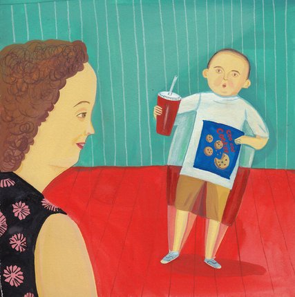

**Baby fat?**

****

Feel free to call these floating angels—or cherubs—Rubenesque. For they were indeed painted by Rubens. 

But many children today, given unfettered access to high-calorie foodstuffs, are showing Rubenesque curves. According to a recent study in *Childhood Obesity*, parents increasingly see their chubby children as cherubs, and are turning a blind eye as their kids pack on pounds. More than three-quarters of parents of pre-school-age obese sons and nearly 70 percent of parents of obese daughters described their children as “about the right weight.” And the likelihood that parents can estimate their child’s weight accurately has declined about 30 percent, leading one doctor to coin the problem “oblivobesity.” —*Diane Richard, writer, June 16*

**

Image: Giselle Potter
 Source: Jan Hoffman, “Parents’ Denial Fuels Childhood Obesity Epidemic,” *The New York Times,* June 15, 2015 

