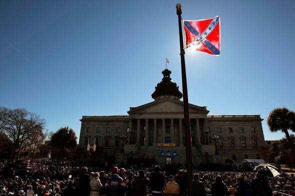

**What gives a flag its power?**

****

After the recent mass shooting at a historically black church in Charleston, South Carolina, attention turned to the flag flying at the state capitol—the same Confederate battle flag brandished by the white supremacist gunman. A week later, Alabama removed the flag from a Confederate memorial on its capitol grounds, stores like Walmart stopped selling it, and Mississippi talked of redesigning its official state flag, the only one still bearing the Confederate symbol.

We endow objects with power, to offend or inspire—a peculiar trait of supposedly rational people. Though it may depend on context. The Charleston Drawing Room, for instance, came from the home of Colonel John Stuart, an 18th-century British sympathizer who owned 200 slaves. Today, he’s largely forgotten, but the memorial to Thomas Jefferson, a fellow slave owner, has now become embroiled in the discussion of our troubled past.

*—Tim Gihring, editor*

*June 24, 2015*

**

Source: Slate.com, June 15, 2015

