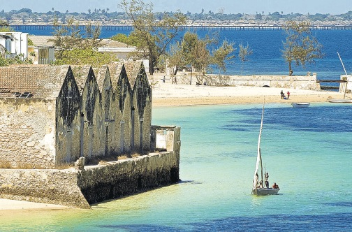

**Evidence of a horrible past?**

****

It’s terrible, but true: without the international slave trade, the Makonde people of northern Mozambique probably wouldn’t exist. They emerged as a distinct culture in the 1800s when refugees from Mozambique’s coastal lowlands—teeming with slave traders then—fled to higher ground inland. In time they became Makonde. 

Now, the wreck of São José Paquete Africa, a Portuguese slave vessel, has been discovered off the southern African coast. It left Mozambique Island in 1794 for Brazil with around 400 prisoners from northern Mozambique. While they wouldn’t have called themselves “Makonde,” some of these captives’ indirect descendants did—and still do.     *—Alex Bortolot, Content Strategist, June 3*

**

Image: A view of Mozambique Island, a former Portuguese slave trade port and a UNESCO World Heritage site, off the coast of Mozambique in south-east Africa.

Source: Helene Cooper, “Grim History Traced in Sunken Slave Ship Found Off South Africa,” *The New York Times*, May 31, 2015

