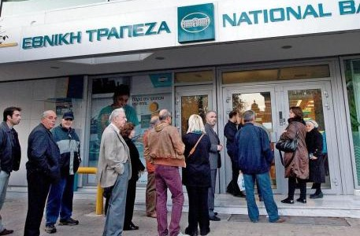

**Can you spare a Drachma? **

****

It’s easy to get riled up about money. The topic can even anger Jesus Christ. In this painting by one of Greece’s greatest sons, El Greco, Christ chases merchants and moneychangers out of the Temple. 

Fast forward to today, as Greek and Eurozone officials scramble to rescue Greece’s failing economy. The Greek population is passionately divided about whether to keep the euro or return to the drachma. Many Greeks want Eurozone support, but don’t want to face the austerity measures that accompany yet another bailout. With difficult choices and repercussions to face, perhaps Greeks should consider, “What would Jesus do?”
 *  —Juline Chevalier, Head of Interpretation, July 15*

**

Photo credit: *The National Herald*

News source: Jack Ewing, “Greece’s Banks Are Next in Line for a European Bailout,” *The New York Times*, July 13, 2015

