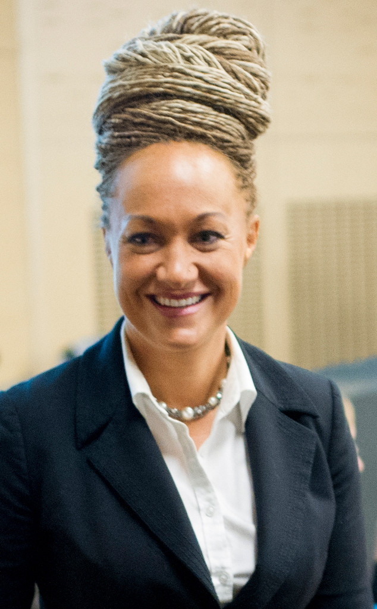

**Cultural Appropriation?**

At first glance, this dress resembles a typical European gown from the 1700s. A closer look at the work reveals a commentary by the artist that criticizes colonialism and trade between dominant and historically oppressed cultures. The fabric for this dress, although made for the African market, was produced in Britain. What’s more, the designs and production technique were appropriated from another culture in Indonesia. 

Accusations about cultural appropriation are nothing new, or so recent headlines report. The story of Rachel Dolezal “identifying as black” raises questions and concerns about race and identity. Adopting black culture to the point of creating a different racial identity has put Dolezal’s motivations in a questionable light, leading to her resignation as leader of the Spokane chapter of the NAACP. 

Are these acts of appropriation and borrowing traditions from other cultures harmless, or are there negative consequences?      *—Abbey Thomsen, Intern,**June 29*

**

**

Photo credit: Tyler Tjomsland, *The Spokesman-Review*

Source: 'I Identify As Black,' Rachel Dolezal Says In TV Interview,’” National Public Radio, June 16

