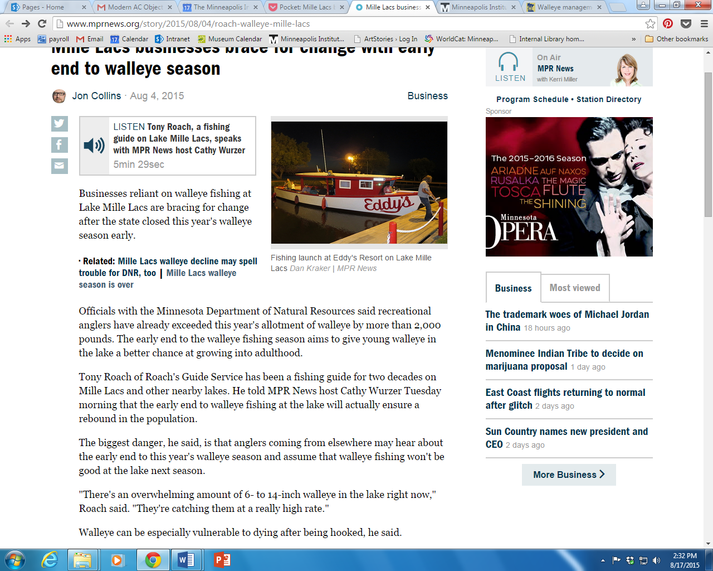

**Fishing gone?**

****

Today, most people don’t wear button-down shirts and ties to go fishing. The fashion has changed, but the popularity of fishing endures—especially in Minnesota, where it’s a much-loved summer pastime and industry. 

Yet the walleye population in Minnesota’s Lake Mille Lacs has been declining for decades. This year the number of fish reached a critically low level, and the walleye fishing season had to be cut short. Overfishing puts the animal and ecosystem at risk, but it also affects people who work at or on the lake. The season’s unseasonably early end has cut into prime earning time for its businesses at Mille Lacs.      *—Juline Chevalier, Head of Interpretation*

*August 17*

Photo credit: Dan Kraker, MPR News

News source: Jon Collins, “Mille Lacs businesses brace for change with early end to walleye season,” *MPR News*, August 4, 2015

