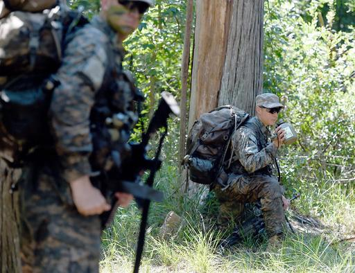

**When is a duck not a duck?**

****

****

Two female soldiers recently graduated from Ranger School in Fort Benning, Ga., the first women to have made it through the Army’s top course and one of the military’s most rigorous and excruciating training programs. Diana the Huntress would be proud.

But whether they can serve as infantry or tank officers is still up for debate. Despite having proven their mettle alongside the male soldiers, meeting precisely the same standards, including the initial physical tests—49 push-ups, 59 situps, six chin-ups, and a five-mile run in no more than 40 minutes—as women they remain ineligible to serve in combat roles.          —*Diane Richard, writer, August 19*

**

Image: Nick Tomecek/Northwest Florida Daily News, via Associated Press
 Source: Richard A. Oppel Jr., “Two Female Soldiers Poised to Graduate From Ranger School,” *The New York Times,* August 17, 2015 

