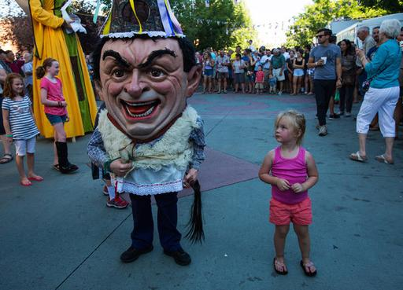

**Boise, Basque Country?**

****

****

You probably think “potato” when you think of Idaho, not Joan Miró.

But every five years, the state’s Basque population shouts, “Ongi Etorri!” (Basque for “Welcome!”) Which would put a smile on the Basque artist’s face. A street party called *Jaialdi* (Basque for “festival time”) takes over downtown Boise, celebrating the roots sunk by immigrants from Northern Spain who mostly came as shepherds in the early 20th century. With an estimated 35,000 or more attendees, Boise hosts one of the biggest Basque festivals outside Europe.

      —*Diane Richard, writer, August 5*

Image: Ruth Fremson/*The New York Times*
 Source: Kirk Johnson, “A Taste of Basque Paella Amid Idaho’s Potatoes,” *The New York Times,* August 4, 2015 

