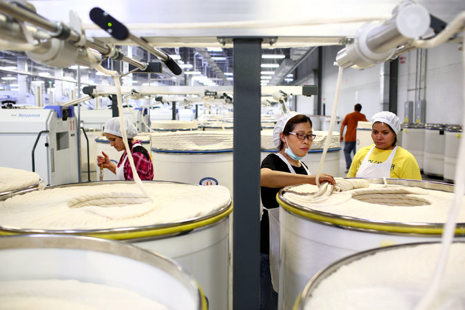

**Turn about fair play?**

****

****

Trade between China and the U.S. is older than this wallpaper. And for years, China’s cheap manufacturing has helped cause the collapse of American factories. But things are changing: now, China is off-shoring its textile production to more economical bases—like the cotton mills of South Carolina.

After years of rising wages, higher energy bills, and mounting logistical costs, textile production in China is becoming increasingly unprofitable. Today, the opposite forces—depressed wages, abundant land and energy, and heavily subsidized cotton—are making the United States more competitive. The Carolinas are now home to some 20 Chinese manufacturers, which spin cotton into spools of yarn. —*Diane Richard, writer, August 5*

**

Image: Travis Dove for *The New York Times*
 Source: Hiroko Tabuchi, “Chinese Textile Mills Are Now Hiring in Places Where Cotton Was King,” *The New York Times,* August 2, 2015 

